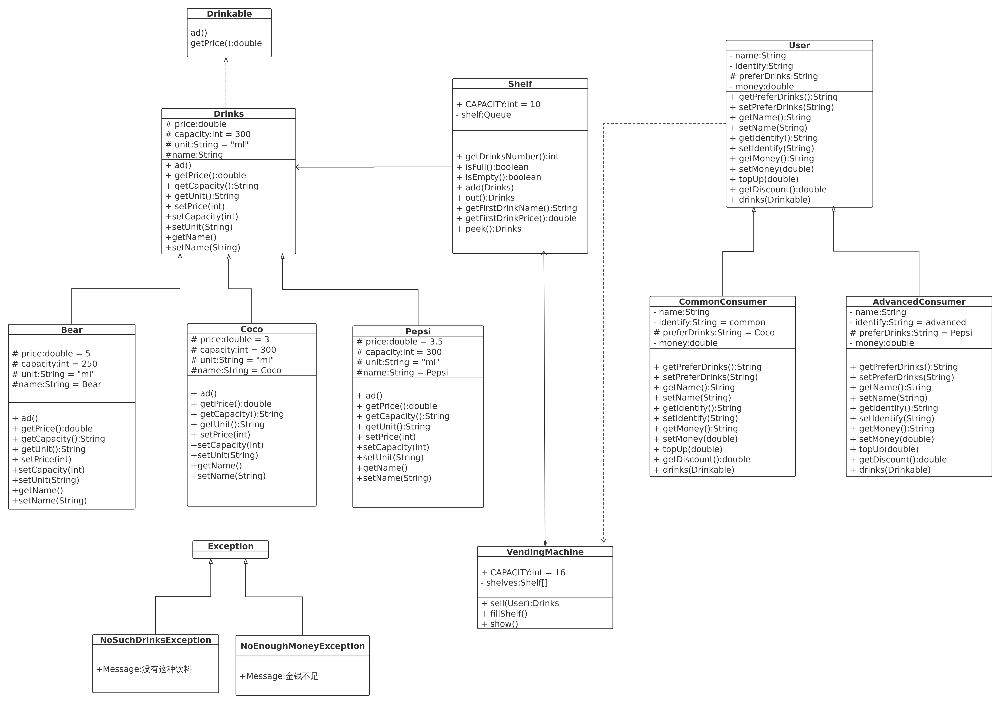

## Java饮料自动售货机  

实现一个自动售出饮料的机器，用与练习java的面向对象，接口，继承，多态，抽象类等基础知识  

目录结构:  

```
|--com
    |--yohoyes
        |--beverages                    --负责饮料的包
            |--impl                     --包含各种饮料的具体实现类
            |--Drinkable                --定义所有可以饮用的东西共有的接口
            |--Drinks                   --所有饮料的公有抽象父类
        |--exception                    --自定义异常
            |--NoEnoughMoneyException   --钱不够异常
            |--NoSuchDrinksException    --没有这种饮料异常
        |--factory                      --工厂类
            |--DrinkFactory             --饮料工厂
            |--UserFactory              --用户工厂
        |--machine                      --负责售货机的包
            |--Shelf                    --货架
            |--VendingMachine           --售货机
        |--pojo                         --负责定义人物的包
            |--AdvancedConsumer         --会员
            |--CommonConsumer           --普通用户
            |--User                     --会员和普通用户共有类
        |--Main                         --程序入口
```

### UML类图  

  

**PDF**  

[UML](./src/main/resources/UML.pdf)    
